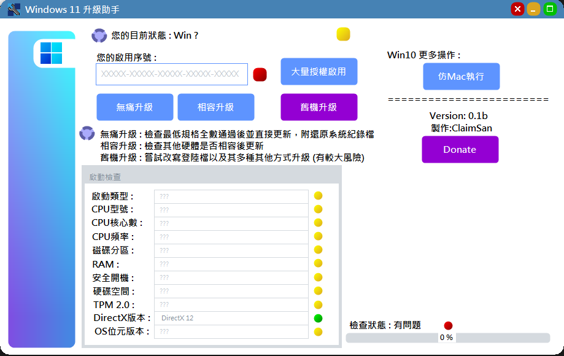

# Win11BypassTPMassistant

**版本1.0**


## 介紹


---

### 直接開始

> 重點註記

```text
下載此項目: [鏈結] vfdvdf

```

`sdvsdvsdv`

## 下載
下載此項目: [鏈結](https://www.youtube.com/watch?v=ppMXtTbNnCs) sdv

## 簡述

1. sdvsdv

2. ecwecdc

3. sdvsdv

## 特色


- 入門快
- 執行快
- 精準度佳

[返回頂部](#Win11BypassTPMassistant)

[跳至_直接開始](#直接開始)

[跳至_下載](#下載)

[跳至_簡述](#簡述)

[跳至_特色](#特色)